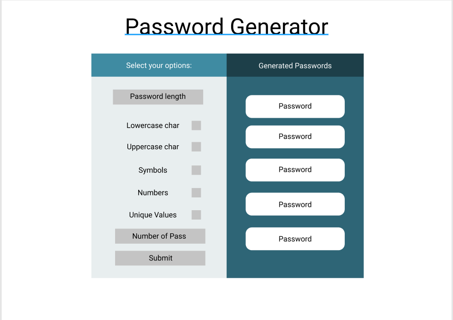
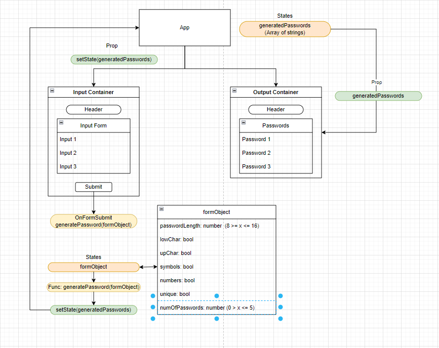

# Password-Generator
A password generator powered by React.js

# Description
A simple password generator application that take a user's input and generates random passwords based off that input. This application is built off of React.js and styled with Bootstrap. 

# Link to Deployed App :link:
_Insert link here when deployed!_

# Goals for Deployment
[ ] User can provide input based on provided selections
[ ] User can submit selection for password generation
[ ] Passwords are displayed upon submission

# Initial Design
My initial design of the password generator, designed on Figma.

# Project Framework
The initial framework and logic for this project, designed on draw.io.

